# EEG Preprocessing and analysis [WS2020]
Welcome to the practical part of the EEG course.
- You can find information on the semesterproject in `./semesterproject`
- You can find the exercises in `./exercises`
- Data and results will be saved to `./local` by default, but can be changed

## Filtering
The raw data we get has a has all frequencies below 128 Hz:  
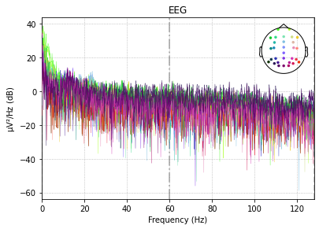

### High-pass filtering
We are less interested in very low frequncies, as they are often due to the drying of the EEG gel which increases resistance between the scull and electrodes. Low frequencies can be observed as a slow drift.
As shown in the figure below, a high-pass filter of 0.1 Hz removes most slow drifts, aswell as the offset.
However, there if drifts become stronger the drift is not corrected:  
  
Increasing the high-pass filter to 0.3 Hz seems to improve the problem:  
  
High-pass filtering with 0.4 Hz satisfies me:  
  
I didn't want to increase the frequency of the high-pass filter further, because [Widmann et al. show](https://www.sciencedirect.com/science/article/pii/S0165027014002866?via%3Dihub#sec0085) that a value of 0.75 might lead to minor reductions of the P3 response amplitude.

### Low-pass filtering
The signal to noise ratio decreases with high frequencies. Reasons for this are, that noise due to the power line are at 60 Hz (in the US) and alpha, beta, delta and theta frequencies are below 30 Hz. 
However, gamma frequencies are higher. In a compromise to keep low gamma frequencies but block noise from the powerline and noisy frequencies above that, a low-pass filter of 54 Hz is applied.  
The frequency spectrum after band-pass filtering can be seen in the figure below.  
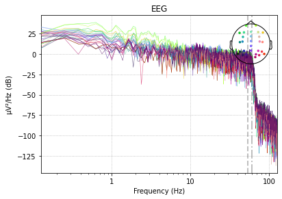  

To investigate, if the low-pass filter has the expected effect, let's zoom in.
Raw:  
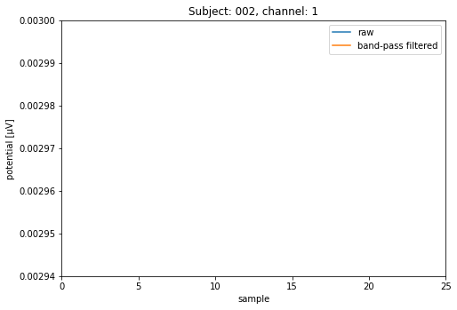  
Filtered:  
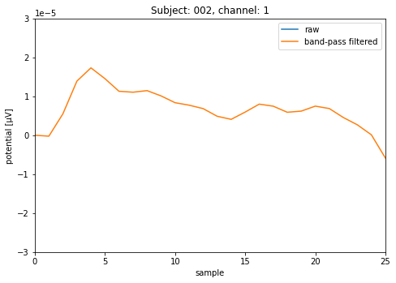  
It looks good, as high frequcies seem to be supessed.

## ICA
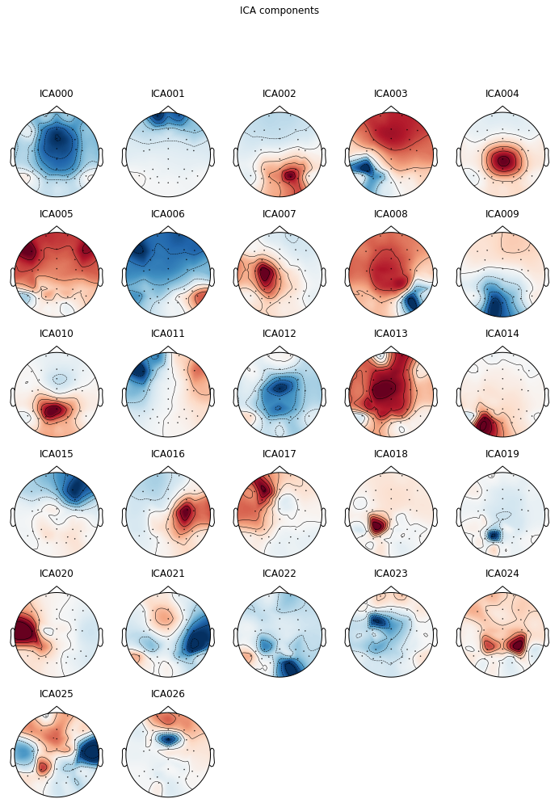
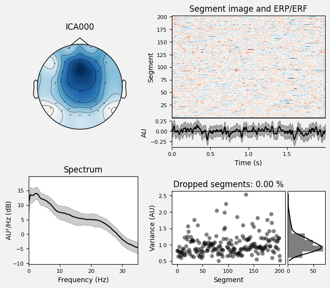
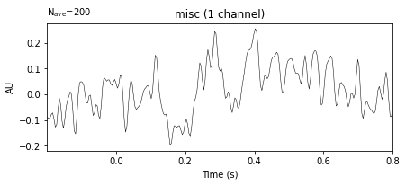
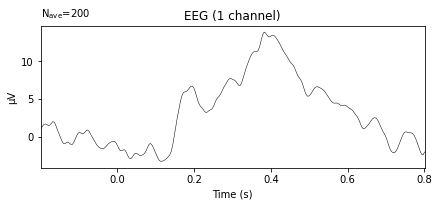
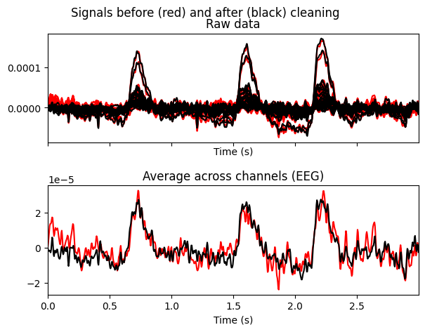
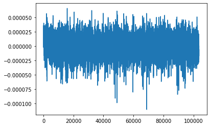
## Event-related potential (ERP)
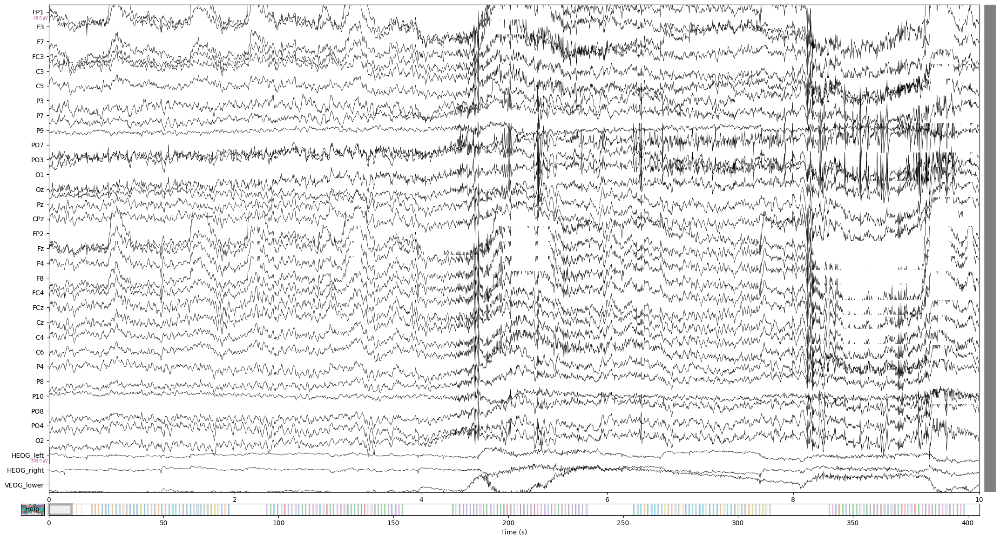
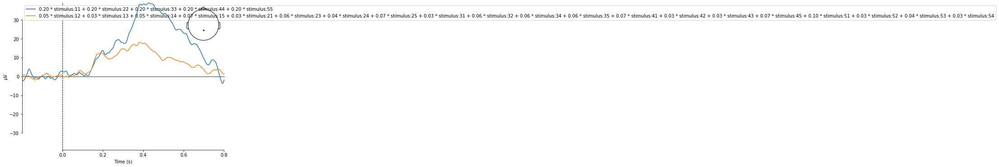
