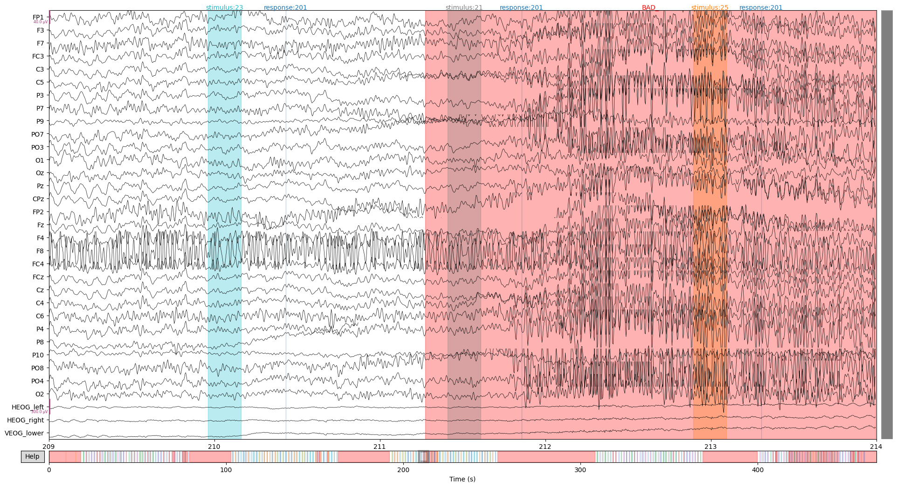
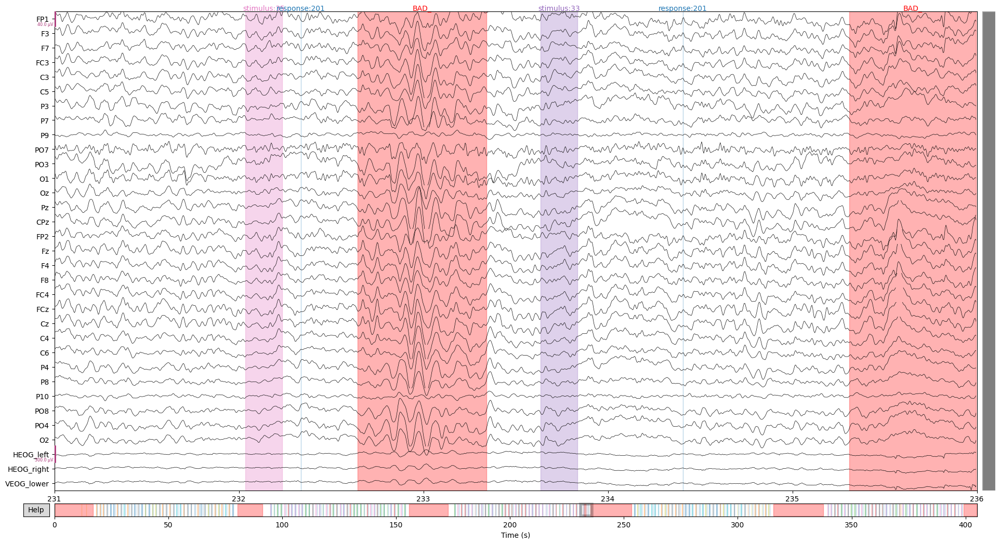

# EEG Preprocessing and analysis [WS2020]
Welcome to the practical part of the EEG course.
- You can find information on the semesterproject in `./semesterproject`
- You can find the exercises in `./exercises`
- Data and results will be saved to `./local` by default, but can be changed

## Downsampling
To speed up processing the data is downsampled from 1024.0 Hz to 256.0 Hz.

## Rereferencing
Before rereferencing a partial plot of the data looks the following:
  
The data is rereferneced to P9 and P10 because [Kappenman et al.](https://www.sciencedirect.com/science/article/pii/S1053811920309502) find "that P9 and P10 provide cleaner signals than the traditional mastoid sites".  
The rereferencing seems to work, as the variance of channel P9 and P10 decreased:


## Montage
Set EEG sensor configuration and head digitization to the international 10–20 system, because it contains more [realistic](https://mne.tools/dev/auto_tutorials/intro/plot_40_sensor_locations.html) channel positions than a spherical head digitization.  


## Filtering
The raw data we get has a has all frequencies below 128 Hz:  


### High-pass filtering
We are less interested in very low frequncies, as they are often due to the drying of the EEG gel which increases resistance between the scull and electrodes. Low frequencies can be observed as a slow drift.
As shown in the figure below, a high-pass filter of 0.1 Hz removes most slow drifts, aswell as the offset.
However, there if drifts become stronger the drift is not corrected:  
  
Increasing the high-pass filter to 0.3 Hz seems to improve the problem:  
  
High-pass filtering with 0.4 Hz satisfies me:  
  
I didn't want to increase the frequency of the high-pass filter further, because [Widmann et al. show](https://www.sciencedirect.com/science/article/pii/S0165027014002866?via%3Dihub#sec0085) that a value of 0.75 might lead to minor reductions of the P3 response amplitude.

### Low-pass filtering
The signal to noise ratio decreases with high frequencies. Reasons for this are, that noise due to the power line are at 60 Hz (in the US) and alpha, beta, delta and theta frequencies are below 30 Hz. 
However, gamma frequencies are higher. In a compromise to keep low gamma frequencies but block noise from the powerline and noisy frequencies above that, a low-pass filter of 54 Hz is applied.  
The frequency spectrum after band-pass filtering can be seen in the figure below.  
  

To investigate, if the low-pass filter has the expected effect, let's zoom in.
Raw:  
  
Filtered:  
  
It looks good, as high frequcies seem to be supessed.

## Cleaning
By subjective manual visual inspection I removed all the breaks, aswell as noisy intervals. 
In the next plots I try to show the most relevant cleaning parts. 
However, if you want to see all data of the claning process, you can set ```closeInteractiveCleaningPlot``` in the  file to ```False``` to open an interactive plot.

### Subject one
Unfortunately, the variance ob subject one seems to increase significantly. Especially channel F8 but FP2, F4 and FC4, which are next to F8. I considered removing and interpolating F8, but decided not to do it, due to concerns that interpolating a very noisy channel with the help of other noisy channels might not increase the signal to noise ratio. Furthermore, F8 is an outmost channel which means interpolations becomes more like extrapolation with even more uncertainty in the signal.
The plot below shows the noise of channel F8 and a very noisy interval.
  

### Subject two
Subject two sees pretty clean to me. I removed the breaks and only a few short intervals as it seems a bit more noisy or to oscillate more:
  

## ICA


## Event-related potential (ERP)


