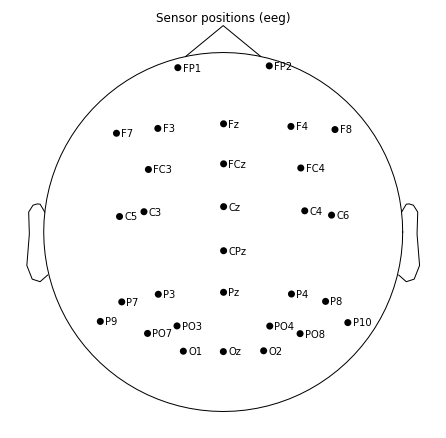
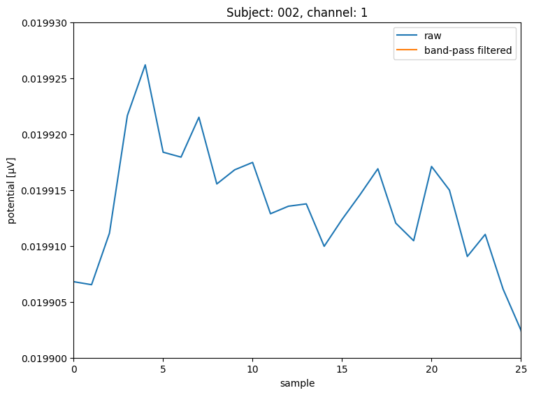
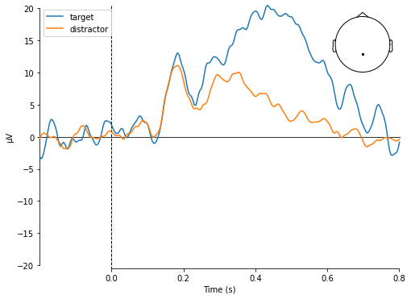

# EEG Preprocessing and analysis [WS2020]
Welcome to the practical part of the EEG course.
- You can find information on the semesterproject in `./semesterproject`
- You can find the exercises in `./exercises`
- Data and results will be saved to `./local` by default, but can be changed

## Downsampling
To speed up processing the data is downsampled from 1024.0 Hz to 256.0 Hz.

## Rereferencing
Before rereferencing a partial plot of the data looks the following:
  
The data is rereferneced to P9 and P10 because [Kappenman et al.](https://www.sciencedirect.com/science/article/pii/S1053811920309502) find "that P9 and P10 provide cleaner signals than the traditional mastoid sites".  
The rereferencing seems to work, as the variance of channel P9 and P10 decreased:


## Montage
Set EEG sensor configuration and head digitization to the international 10–20 system, because it contains more [realistic](https://mne.tools/dev/auto_tutorials/intro/plot_40_sensor_locations.html) channel positions than a spherical head digitization.  


## Filtering
The raw data we get has a has all frequencies below 128 Hz:  


### High-pass filtering
We are less interested in very low frequncies, as they are often due to the drying of the EEG gel which increases resistance between the scull and electrodes. Low frequencies can be observed as a slow drift.
As shown in the figure below, a high-pass filter of 0.1 Hz removes most slow drifts, aswell as the offset.
However, there if drifts become stronger the drift is not corrected:  
  
Increasing the high-pass filter to 0.3 Hz seems to improve the problem:  
  
High-pass filtering with 0.4 Hz satisfies me:  
  
I didn't want to increase the frequency of the high-pass filter further, because [Widmann et al. show](https://www.sciencedirect.com/science/article/pii/S0165027014002866?via%3Dihub#sec0085) that a value of 0.75 might lead to minor reductions of the P3 response amplitude.

### Low-pass filtering
The signal to noise ratio decreases with high frequencies. Reasons for this are, that noise due to the power line are at 60 Hz (in the US) and alpha, beta, delta and theta frequencies are below 30 Hz. 
However, gamma frequencies are higher. In a compromise to keep low gamma frequencies but block noise from the powerline and noisy frequencies above that, a low-pass filter of 54 Hz is applied.  
The frequency spectrum after band-pass filtering can be seen in the figure below.  
  

To investigate, if the low-pass filter has the expected effect, let's zoom in.
Raw:  
  
Filtered:  
  
It looks good, as high frequcies seem to be supessed.

## Cleaning
By subjective manual visual inspection I removed all the breaks, aswell as noisy intervals. 
In the next plots I try to show the most relevant cleaning parts. 
However, if you want to see all data of the claning process, you can set ```closeInteractiveCleaningPlot``` in the  file to ```False``` to open an interactive plot.

### Manual cleaning
#### Subject one
Unfortunately, the variance ob subject one seems to increase significantly. Especially channel F8 but FP2, F4 and FC4, which are next to F8. I considered removing and interpolating F8, but decided not to do it, due to concerns that interpolating a very noisy channel with the help of other noisy channels might not increase the signal to noise ratio. Furthermore, F8 is an outmost channel which means interpolations becomes more like extrapolation with even more uncertainty in the signal.
The plot below shows the noise of channel F8 and a very noisy interval.
  

#### Subject two
Subject two seems pretty clean to me. I removed the breaks and only a few short intervals as it seems a bit more noisy or to oscillate more:
  

#### Subject three
Subject three seems clean to me. 
I only removed the breaks. 
However, as can be seen in the plot below, there are spikes on channels close to the eyes about 300ms after the response. The magnitude of the spikes seem to be negatively correlated with the distance to the eyes.
My guess is, that subject three blinked often right after responding. 
If that is the case I expect to see it very clearly when inspecting the results of the ICA.
For now, I will not remove the spikes manually, since the spikes are after most responses and if my guess is right, then it's better to remove them by removing the independent component of the blinks after ICA. 
  

### Automated threshold cleaning
I also tried rejecting epochs based on the absolute difference between the lowest and the highest signal value (peak-to-peak signal amplitude). In each individual epoch, the peak-to-peak signal amplitude is calculated for every EEG and EOG channel. If the peak-to-peak signal amplitude of any one channel exceeds the rejection threshold, the respective epoch will be dropped.

#### Subject one
In the following plot you can see that manual cleaning seems lead to a better average ERP than automated rejection with a threshold of 200 µV. Automated rejection seems to hardly do anything:


Maybe the treshold of 200 µV is too relaxed and I lowered tried 100 µV:


In the plot above, the 100 µV treshold seems too harsh, so I increased it to 125 µV:


The threshold of 125 µV seems about right for subject one. This is the threshold I will also try for subject two and tree.

I was wondering how it looks like to apply both, manual and 125 µV threshold rejection:

The me this seems to lead to the best ERP. 
However, I'm not sure if it's good practive to adapt the procedure like this according to how the ERP looks like. Do I run the risk of cherry picking or overfitting?

#### Subject two
As shown in the plot below, manual or threshold cleaning had only a slight impact on the average ERP:


#### Subject three
  
The average ERP of subject three differes oviously differes between manual and rejection cleaning. The reason is probably that I didn't remove data even though there were many spikes after the responses of the subject.
Subject three lead me to the decision that I will not use automated rejection by a threshold and only reject manually due to two reasons:
First, rejecting with a threshold had such a great impact, but did not lead to a satisfying average ERP.
Second, I'm still hopeful that what looks like noise now can be cleaned in a better way by removing the unwanted (bink) components.


## ICA
### Subject one


### Subject two


### Subject three


## Event-related potential (ERP)


