# EEG Preprocessing and analysis [WS2020]
Welcome to the practical part of the EEG course.
- You can find information on the semesterproject in `./semesterproject`
- You can find the exercises in `./exercises`
- Data and results will be saved to `./local` by default, but can be changed

## general info TODO
units:
voltage potentials are described as "value", "amplitude", "potential" and if not noted otherwise the unit is µV  
time is always in seconds

## Downsampling
To speed up processing the data is downsampled from 1024.0 Hz to 256.0 Hz.

## Rereferencing
Before rereferencing a partial plot of the data looks the following:
  
The data is rereferneced to P9 and P10 because [Kappenman et al.](https://www.sciencedirect.com/science/article/pii/S1053811920309502) find "that P9 and P10 provide cleaner signals than the traditional mastoid sites".  
The rereferencing seems to work, as the variance of channel P9 and P10 decreased:


## Montage
Set EEG sensor configuration and head digitization to the international 10–20 system, because it contains more [realistic](https://mne.tools/dev/auto_tutorials/intro/plot_40_sensor_locations.html) channel positions than a spherical head digitization.  


## Filtering
The raw data we get has a has all frequencies below 128 Hz:  


### High-pass filtering
We are less interested in very low frequncies, as they are often due to the drying of the EEG gel which increases resistance between the scull and electrodes. Low frequencies can be observed as a slow drift.
As shown in the figure below, a high-pass filter of 0.1 Hz removes most slow drifts, aswell as the offset.
However, there if drifts become stronger the drift is not corrected:  
  
Increasing the high-pass filter to 0.3 Hz seems to improve the problem:  
  
High-pass filtering with 0.4 Hz satisfies me:  
  
I didn't want to increase the frequency of the high-pass filter further, because [Widmann et al. show](https://www.sciencedirect.com/science/article/pii/S0165027014002866?via%3Dihub#sec0085) that a value of 0.75 might lead to minor reductions of the P3 response amplitude.

### Low-pass filtering
The signal to noise ratio decreases with high frequencies. Reasons for this are, that noise due to the power line are at 60 Hz (in the US) and alpha, beta, delta and theta frequencies are below 30 Hz. 
However, gamma frequencies are higher. In a compromise to keep low gamma frequencies but block noise from the powerline and noisy frequencies above that, a low-pass filter of 54 Hz is applied.  
The frequency spectrum after band-pass filtering can be seen in the figure below.  
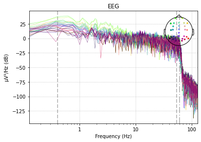  

To investigate, if the low-pass filter has the expected effect, let's zoom in.
Raw:  
  
Filtered:  
  
It looks good, as high frequcies seem to be supessed.

## Cleaning
By subjective manual visual inspection I removed all the breaks, aswell as noisy intervals. 
In the next plots I try to show the most relevant cleaning parts. 
However, if you want to see all data of the claning process, you can set ```closeInteractiveCleaningPlot``` in the [config.py](./semesterproject/config.py) file to ```False``` to open an interactive plot.

### Manual cleaning
#### Subject one
Unfortunately, the variance ob subject one seems to increase significantly. Especially channel F8 but FP2, F4 and FC4, which are next to F8. I considered removing and interpolating F8, but decided not to do it, due to concerns that interpolating a very noisy channel with the help of other noisy channels might not increase the signal to noise ratio. Furthermore, F8 is an outmost channel which means interpolations becomes more like extrapolation with even more uncertainty in the signal.
The plot below shows the noise of channel F8 and a very noisy interval.
  

If wanted, bad channels can be flagged in the function ```cleaning(raw_f, subject)``` by adding the channel name to the list ```raw_f.info["bads"] = []``` and removing the comment before ```raw_f.interpolate_bads()```. 

#### Subject two
Subject two seems pretty clean to me. I removed the breaks and only a few short intervals as it seems a bit more noisy or to oscillate more:
  

#### Subject three
Subject three seems clean to me. 
I only removed the breaks. 
However, as can be seen in the plot below, there are spikes on channels close to the eyes about 300ms after the response. The magnitude of the spikes seem to be negatively correlated with the distance to the eyes.
My guess is, that subject three blinked often right after responding. 
If that is the case I expect to see it very clearly when inspecting the results of the ICA.
For now, I will not remove the spikes manually, since the spikes are after most responses and if my guess is right, then it's better to remove them by removing the independent component of the blinks after ICA. 
  

### Automated threshold cleaning
I also tried rejecting epochs based on the absolute difference between the lowest and the highest signal value (peak-to-peak signal amplitude). In each individual epoch, the peak-to-peak signal amplitude is calculated for every EEG and EOG channel. If the peak-to-peak signal amplitude of any one channel exceeds the rejection threshold, the respective epoch will be dropped.

#### Subject one
In the following plot you can see that manual cleaning seems lead to a better average ERP than automated rejection with a threshold of 200 µV. Automated rejection seems to hardly do anything:


Maybe the treshold of 200 µV is too relaxed and I lowered tried 100 µV:


In the plot above, the 100 µV treshold seems too harsh, so I increased it to 125 µV:


The threshold of 125 µV seems about right for subject one. This is the threshold I will also try for subject two and tree.

I was wondering how it looks like to apply both, manual and 125 µV threshold rejection:

The me this seems to lead to the best ERP. 
However, I'm not sure if it's good practive to adapt the procedure like this according to how the ERP looks like. Do I run the risk of cherry picking or overfitting?

#### Subject two
As shown in the plot below, manual or threshold cleaning had only a slight impact on the average ERP:


#### Subject three
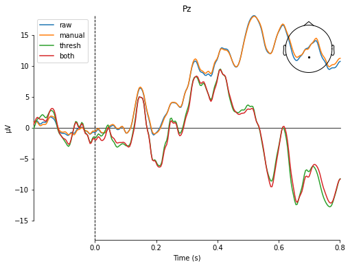  
The average ERP of subject three differes oviously differes between manual and rejection cleaning. The reason is probably that I didn't remove data even though there were many spikes after the responses of the subject.
Subject three lead me to the decision that I will not use automated rejection by a threshold and only reject manually due to two reasons:
First, rejecting with a threshold had such a great impact, but did not lead to a satisfying average ERP.
Second, I'm still hopeful that what looks like noise now can be cleaned in a better way by removing the unwanted (bink) components.

### Removing bad subjects
I regard subject 1 to 3 as too valuable to remove them completely. 


## ICA
ICA is sensitive to low-frequency drifts. Therefore I'm applying a high pass filter of 1.5 Hz to the data prior to fitting.
Then I generate an ICA object. For conveiniene the random state is fixed to make it deterministic, thus reproducible.
The ICA opject is fitted on the the cleaned data, where the 1.5Hz high pass filter was applied. 
The goal is to use ICA to break the signal of the different sensors into independent components.
This is useful as we are only interested in brain components but also receive potentials from other sources. 
These other sources are disturbing the analysis of brain signals, thus they are unwanted.
The most common noise sources are muscle activity at or close to the head, eye blinks, eye movement, heart beat and noisy electrodes.  
Next, I will show how the ICA results of subject 001 look like and how I interpret them.

### Component inspection and classification
The interpretation of subject one is in detail, whereas subject two and three it's only briefly.  

#### Subject one
I classified componenet 000 and 013 as eye-blinks and removed it. The reasons are:  
&nbsp;&nbsp;&nbsp;&nbsp;&nbsp;&nbsp;1. The ERP segments are colored in a few epochs for about 100 ms which is about the time it takes to blink.  
&nbsp;&nbsp;&nbsp;&nbsp;&nbsp;&nbsp;2. the power spectrum is heavy on very low frequencies and falls quickly  
&nbsp;&nbsp;&nbsp;&nbsp;&nbsp;&nbsp;3. The sensor location map is colored where the eyes are  


I classified componenet 001 as brain acitivy, and therefore didn't remove it. The reasons are:  
&nbsp;&nbsp;&nbsp;&nbsp;&nbsp;&nbsp;1. The ERP segments are colored relatively homogeniously. I would also expect that brain activity looks homogenious.  
&nbsp;&nbsp;&nbsp;&nbsp;&nbsp;&nbsp;2. Most importantly, the Power spectrum increases around 10 Hz which is a important brain frequency band of the brain.  
&nbsp;&nbsp;&nbsp;&nbsp;&nbsp;&nbsp;3. I could make any conclusions about the sensor location map   


I classified componenet 002 as muscle artifacts, and therefore removed it. The reasons are:  
&nbsp;&nbsp;&nbsp;&nbsp;&nbsp;&nbsp;1. The ERP segments seem to have two horizontal patterns spanning over multiple epochs. The first ranging from about Epoch 55 to 65 and the second starting at about Epoch 90 til the End. My guess is that maybe muscles were active during these epochs.  
&nbsp;&nbsp;&nbsp;&nbsp;&nbsp;&nbsp;2. Most importantly, the Power spectrum increases looks like the mathematical root symbol, which is typical for muscle artifacts.  
&nbsp;&nbsp;&nbsp;&nbsp;&nbsp;&nbsp;3. Since the sensor location map is colored at about 2 o'clock, it might be a muscle close to the right eyebrow. 

015, 020 look similar:


Component 003 has a very stong power around the 10 Hz frequency band, and another smaller bump close to 20 Hz, which indicates brain activity. Furthermore, the active area at the back of the head seems plausible for brain activity and the ERP segments are colored regularly. I did not remove this component.  


Component 004 looks very similar to 003, I labeled it also as brain activity.


Similar to 003 but the peak in the power spectrum is at 10 and 20 Hz is smaller. Nevertheless, interpret it as brain acitivty and didn't remove it.


006 looks similar to 005, thus not removed.


007 seems not sufficiently independent. I suspect brain activity due to a power peak at 10 Hz, but also muscle activity from about epoch 60 to 75. I wasn't sure weather to keep this component and labeled it as unsure, but removed it eventually. 

Similarly looks 23, 24, 26, 27. Maybe, the ICA didn't work properly. However, increasing the maximum number of iterations from default 200 to 400 didn't help. Future work I would try lowering the highpass-filter to 1 Hz or increasing it to 2Hz, and see if s.th. the separation into independednt component improves.

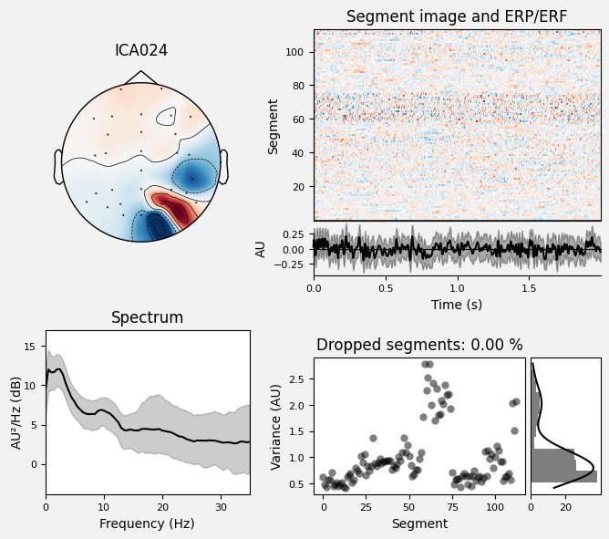

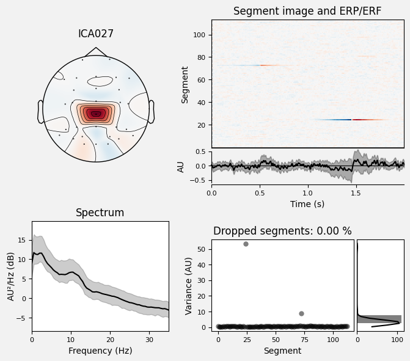

Similar to component 002 this looks like a muscle artefact.


Due to power peak at 10 Hz and homogenious ERP Segments, I labeled components 008, 010, 011, 012, 016, 018, 19, 21,22 as brain activity. 
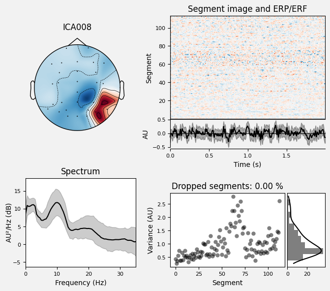


I was unsure about component 14, 25 and labeled it as unsure. Spectrum does not look like brain activity. Maybe heart activity? 


The power spectrum and ERP Segments of 017 look like muscle activity. The electrode map shows a dipole at the eyes, which might result from horizontal eye movement. I removed this component.
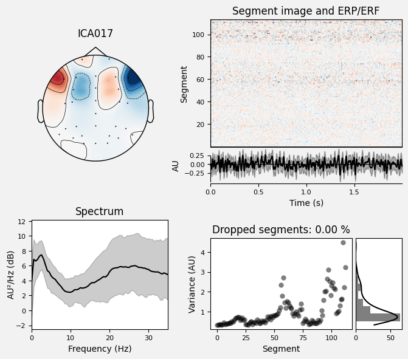

### Subject 2
The quality of subjects two ICA fit seems similar to subject one,   
  
i.e. ICA000 seems to be blinks and ICA 007 brain activity.

  


#### Subject 3 blinks
In the chapter cleaning I made the guess that subject 3 blinked a lot, but didn't remove the sequences from the data. 
This was probably a good choice: As you can see below, ICA000 represent certainly eye blinks. 
Furthermore, 004 and 026 seem to be eye components as well. 
Now, I can remove these components without rejecting whole sequences. 


  
  

#### Summary and file
The component interpretation and classification I described above is summaized in the [file config.py](./semesterproject/config.py). This file also includes my classification of subject 2 and 3, and it functions as a configuration interface to the code. 


### Effect of ICA
After classifying the artefacts to remove, I took a copy of the original filtered signal, where the band-pass filter is between 0.4 and 54 Hz, and not 1.5 and 54 Hz.
I applied the ICA on this signal, excluding the unwanted unwanted independent components.
To evaluate it's effect, I'm visualizing the difference on baseline adjusted epochs.
[The file config.py](./semesterproject/config.py) defines epochs from starting from -0.2 til 0.8 sec and the baseline from -0.2 til 0.0 sec. 

#### Subject 1
The effect of the removed components is shown below. Note how the original signals (red) have more spikes and variance than the signal without the unwanted components from ICA.   
  

Surprisingly, the effect on the evoked data of the Pz channel seems neglectable. I can spot only a tiny difference. I was wondering if s.th. is wrong but could not find a bug. But maybe it's correct, as you will see later, the difference at subject 2 and 3 is greater.  

Evoked Pz before removing labeled components:  
  

Evoked Pz after removing labeled components:  
  

#### Subject 2 and 3
In contrast to subject 1, the before-after-differnce is obvious, as shown in the plot below:  
Subject 2:  
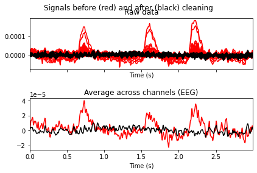  
Evoked Pz before removing labeled components of subject 2:  
  
Evoked Pz after removing labeled components of subject 2:  
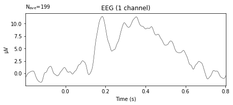  

Subject 3:  
  
Evoked Pz before removing labeled components of subject 3:  
  
Evoked Pz after removing labeled components of subject 3:  
  


## Event-related potential (ERP)
### Single Subject Analysis
We cleaned the signal to better analyze the P300 ERP, during visual oddbal experiments.
Specifically I want to analyze the voltage and latency difference between target distractor stimuli.
As recommended by [Kappenman et al.](https://www.sciencedirect.com/science/article/pii/S1053811920309502), I work mainly with the Pz channel for the P3 oddball experiment.
The coded functions which analyze the ERP of only one subject are defined in ```single_subject_erp_analysis()```

To start, I divided the epochs into ```target``` and ```distractor```.
The evoked Pz signals are plotted below:

### Subject one


### Subject two
Let's to a sanity check: The baseline oscillates a lot, but is centered at 0 µV. Both for target and distractor, there is a rapid spike starting at about 130 ms after Stimulus, peaks at around 180 ms has a local minimum at 230ms. The distractor peaks at around 300ms  and target at 430 ms. This doesn't seem too bad but compared to [Kappenman et al.](https://www.sciencedirect.com/science/article/pii/S1053811920309502) it's ~30ms later. This might be, since I didn't do any time shift due to screen/electronic latency. [Kappenman et al.](https://www.sciencedirect.com/science/article/pii/S1053811920309502), shiftet the time by 26 ms. The might explain the difference between us almost too well.
It's visible, that the target peak is higher (20µV) and later than the distractor peak (10µV), compared to 7 and 13 for [Kappenman et al.](https://www.sciencedirect.com/science/article/pii/S1053811920309502). After peaking, the potential decreases again, and is back at the baseline a bit before 800ms. This is also similar to Kappenman et al. .  

### Subject three
The evoked signals looks surprisingly different between each subject. I wonder if cleaning was not optimal, the brains are different, or it's normal variance due to a small amount of target epochs per subject:  
  


### Inter subject analysis
For each subject I recorded the average evoked signal, peak potential and peak latency, for next chapters inter subject analysis.
I put the data of my last run below. If you want to reproduce my results its saved in: [all_subjects_time_amplitude.csv](./intersubject_results/all_subjects_time_amplitude.csv).
You can have a look at the data, but I like visulaizations, which follow after, much more :)

|subject_id|time_target|time distr|amplitude_target|amplitude_distractor|diff_time  |diff_amplitude      |
|----------|----------------|--------------------|---------------------|-------------------------|-----------|--------------------|
|1         |0.41015625      |0.31640625          |15.346339632945003   |9.143679920627235        |0.09375    |6.202659712317768   |
|2         |0.43359375      |0.18359375          |20.460961929616357   |11.074294096706126       |0.25       |9.38666783291023    |
|3         |0.37109375      |0.328125            |19.5255378054897     |9.253882301972464        |0.04296875 |10.271655503517238  |
|4         |0.6875          |0.6171875           |29.068938183615288   |23.62688632367           |0.0703125  |5.442051859945288   |
|5         |0.51171875      |0.53515625          |19.11925838884308    |13.393702818279474       |-0.0234375 |5.725555570563605   |
|6         |0.3671875       |0.36328125          |12.825446967272926   |12.222515717624482       |0.00390625 |0.602931249648444   |
|7         |0.3515625       |0.5234375           |19.40209387159021    |17.508593007537865       |-0.171875  |1.8935008640523456  |
|8         |0.51171875      |0.4609375           |22.921688803329335   |19.228808590590134       |0.05078125 |3.692880212739201   |
|9         |0.4296875       |0.16015625          |17.45342984381842    |8.240823360683349        |0.26953125 |9.21260648313507    |
|10        |0.5703125       |0.37890625          |11.15725802704592    |9.314626363829145        |0.19140625 |1.8426316632167747  |
|11        |0.34375         |0.34375             |19.05468981098797    |14.484384015866388       |0.0        |4.570305795121582   |
|12        |0.375           |0.35546875          |18.671559837424525   |10.813554844756874       |0.01953125 |7.8580049926676505  |
|13        |0.5390625       |0.43359375          |14.401902408748168   |10.418033114095564       |0.10546875 |3.983869294652603   |
|14        |0.47265625      |0.24609375          |12.894645995545881   |8.991726389915874        |0.2265625  |3.9029196056300073  |
|15        |0.37890625      |0.37890625          |9.9473469695337      |8.205705710744525        |0.0        |1.7416412587891745  |
|16        |0.41796875      |0.3203125           |21.54838128310682    |12.419852172156652       |0.09765625 |9.128529110950169   |
|17        |0.5390625       |0.53125             |12.807847284486325   |8.98444479793633         |0.0078125  |3.8234024865499947  |
|18        |0.49609375      |0.5                 |23.49776567737994    |13.269069404053443       |-0.00390625|10.228696273326499  |
|19        |0.4453125       |0.37109375          |22.40557956463783    |15.606197039560588       |0.07421875 |6.799382525077242   |
|20        |0.77734375      |0.7109375           |8.39957548563998     |8.428067519769366        |0.06640625 |-0.0284920341293855 |
|21        |0.52734375      |0.53125             |18.113715473212874   |10.955952145434107       |-0.00390625|7.157763327778767   |
|22        |0.4296875       |0.44140625          |17.0317619083245     |14.415285377823057       |-0.01171875|2.616476530501444   |
|23        |0.49609375      |0.5390625           |32.88029377903875    |19.983776379566997       |-0.04296875|12.896517399471755  |
|24        |0.42578125      |0.41015625          |19.25450415875357    |9.103715724438748        |0.015625   |10.150788434314821  |
|25        |0.58984375      |0.53125             |26.917312294354694   |12.346040296647045       |0.05859375 |14.57127199770765   |
|26        |0.4375          |0.4453125           |21.25846974574047    |15.622564782886336       |-0.0078125 |5.635904962854134   |
|27        |0.359375        |0.4453125           |12.925943016678834   |10.11156946832835        |-0.0859375 |2.814373548350485   |
|28        |0.69921875      |0.57421875          |11.762156058766147   |8.6250879557972          |0.125      |3.1370681029689464  |
|29        |0.40234375      |0.4296875           |20.436299308932828   |8.060570696231752        |-0.02734375|12.375728612701076  |
|30        |0.48046875      |0.4296875           |25.590493427602226   |25.668166624016003       |0.05078125 |-0.07767319641377668|
|31        |0.5078125       |0.53515625          |12.755089670139043   |7.682863096890457        |-0.02734375|5.072226573248586   |
|32        |0.6171875       |0.5546875           |22.08048778037311    |17.93096420921755        |0.0625     |4.149523571155562   |
|33        |0.38671875      |0.6015625           |11.67638932530273    |7.531091667697478        |-0.21484375|4.145297657605253   |
|34        |0.5             |0.18359375          |17.133447381153992   |9.485241552994582        |0.31640625 |7.64820582815941    |
|35        |0.5             |0.26171875          |17.638933406867803   |13.596030462682313       |0.23828125 |4.0429029441854905  |
|36        |0.5546875       |0.52734375          |19.86354818529312    |14.555610569890291       |0.02734375 |5.307937615402828   |
|37        |0.51953125      |0.53515625          |26.705068399728926   |18.57942852066719        |-0.015625  |8.125639879061737   |
|38        |0.34765625      |0.34375             |17.494008757441744   |11.83156874563007        |0.00390625 |5.662440011811674   |
|39        |0.453125        |0.765625            |18.426331585759694   |10.918717930933397       |-0.3125    |7.507613654826297   |
|40        |0.40625         |0.1796875           |19.860179102817508   |10.17043136810061        |0.2265625  |9.689747734716898   |  

  
  
  
Data about statistics below and saved in [statistics.csv](./intersubject_results/statistics.csv):  


|      |peak_time_target   |peak_time_distractor|peak_amplitude_target|peak_amplitude_distractor|diff_time         |diff_amplitude      |
|------|-------------------|--------------------|---------------------|-------------------------|------------------|--------------------|
|count |40.0               |40.0                |40.0                 |40.0                     |40.0              |40.0                |
|mean  |0.4767578125       |0.43310546875       |18.5178670134335     |12.545088127156          |0.04365234375     |5.972778886277263   |
|std   |0.1005634961961    |0.141496441553      |5.372770464229361    |4.4218995843902          |0.1256739129707   |3.555048983262868   |
|min   |0.34375            |0.16015625          |8.39957548563998     |7.531091667697        |-0.3125           |-0.0776731964138|
|25%   |0.4052734375       |0.34375             |14.032912560730   |9.133688871580114        |-0.0087890625     |3.79077191809723  |
|50%   |0.462890625        |0.4375              |18.863124824206   |11.015123121070       |0.0234375         |5.538978411399711   |
|75%   |0.521484375        |0.5322265625        |21.330947630082   |14.502190654372       |0.0947265625      |8.376362187033845   |
|max   |0.77734375         |0.765625            |32.88029377903    |25.66816662401       |0.31640625        |14.57127199770765   |


The plot below shows the average of target evoked, distractor evoked, and the difference of these two:  
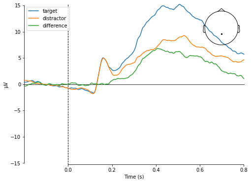  
Let's compare this plot to [Kappenman et al.](https://www.sciencedirect.com/science/article/pii/S1053811920309502):  


|                   | My work | Kappenmann et al. |
|-----------------------|---------|-------------------|
| time first local min  | 140     | 100               |
| time frist local max  | 175     | 150               |
| time second local min | 215     | 190               |
| time distr peak       | 510     | 410               |


If I would also reduce the 26ms screen delay, the numbers match surprisingly well. 


The next plot shows peak amplitude of the distractor vs amplitude of the target. Note that most points are below the first bisector.
Since the x axis is about target and y about distractor, this indicates that most target peaks are stronger than distractor peaks.   
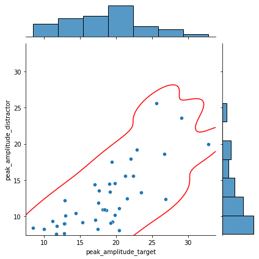  

I plotted the same visulization again, but this time for the timepoint of the peak instead of amplitude:  
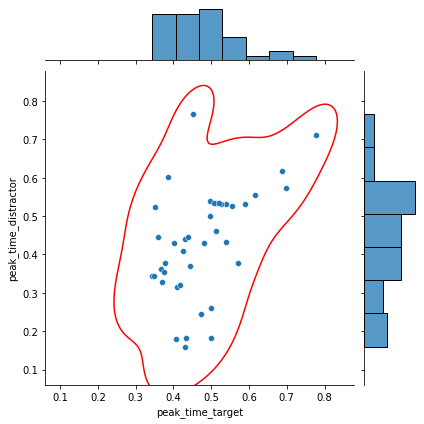  
The result looks similar: Most points are below the first bisector, indicating target peaks occure later than distractor peaks.  


The next plot visualizes extrema, quartiles and mean for the time of the peak of target, distractore evokeds and the difference.
The difference seems to be relatively small. I wonder if the difference is significant. I will test that later on.  
  


I plotted a boxplot again, but this time for the amplitude of the peak instead of timepoint:  
  
Here, a difference is clearly visible. 


#### Permutation t test
Let's do a permutation test to see if there is a significant difference between target and distractor readings.
First comes a permutation test, where the H0 hypothesis is that there is no difference between target and distractor peak time:  
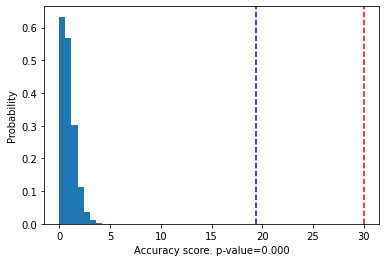  
I am very surprised, as the difference at the boxplot seemed negledgeable, but the computet p-value is an amazing 0.000.
I guess s.th. is wrong with my application of the permutation test :(    

Permutation test, where the H0 hypothesis is that there is no difference between target and distractor peak voltage:  
  
Here it does not surprise me, that the difference is very significant, as the boxplot gave me similar intuition.


## Source Space Localization
To project the EEG/MEG sensor data into a 3-dimensional ‘source space’ positioned in the subject’s brain anatomy with high accuracy, individual maps of the subjects brain anatomy and sensor location is needed.
Unfortunatlely, we don't have any individual information about the anatomy and an average anatomy is assumed.
Source reconstruction without an individual T1 MRI from the subject will be less accurate.
This entails, that we should not over interpret activity locations which can be off by multiple centimeters. 
The average src and bem are taken from the following [tutorial](https://mne.tools/stable/auto_tutorials/source-modeling/plot_eeg_no_mri.html).

Let's check the sensor alignment on our average anatomy. It looks good in the figure below:  
  

Estimate noise covariance matrix from epochs:  
  
  

butterfly_before_source_space_manual  
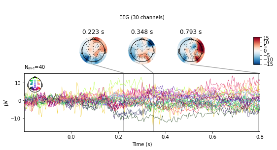  

  


